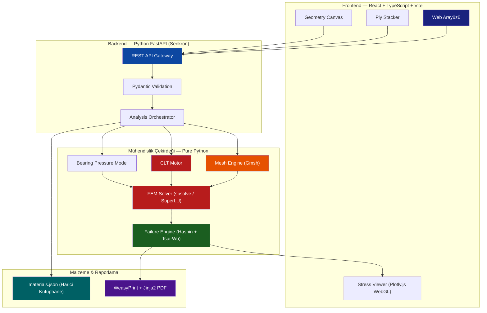
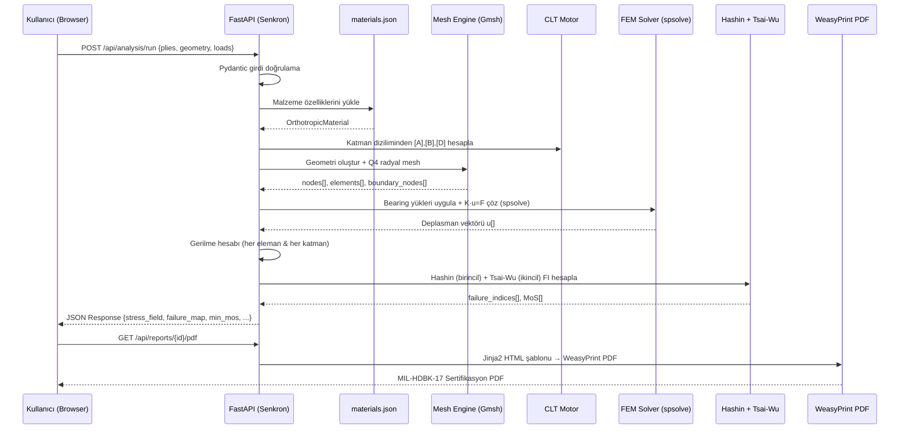
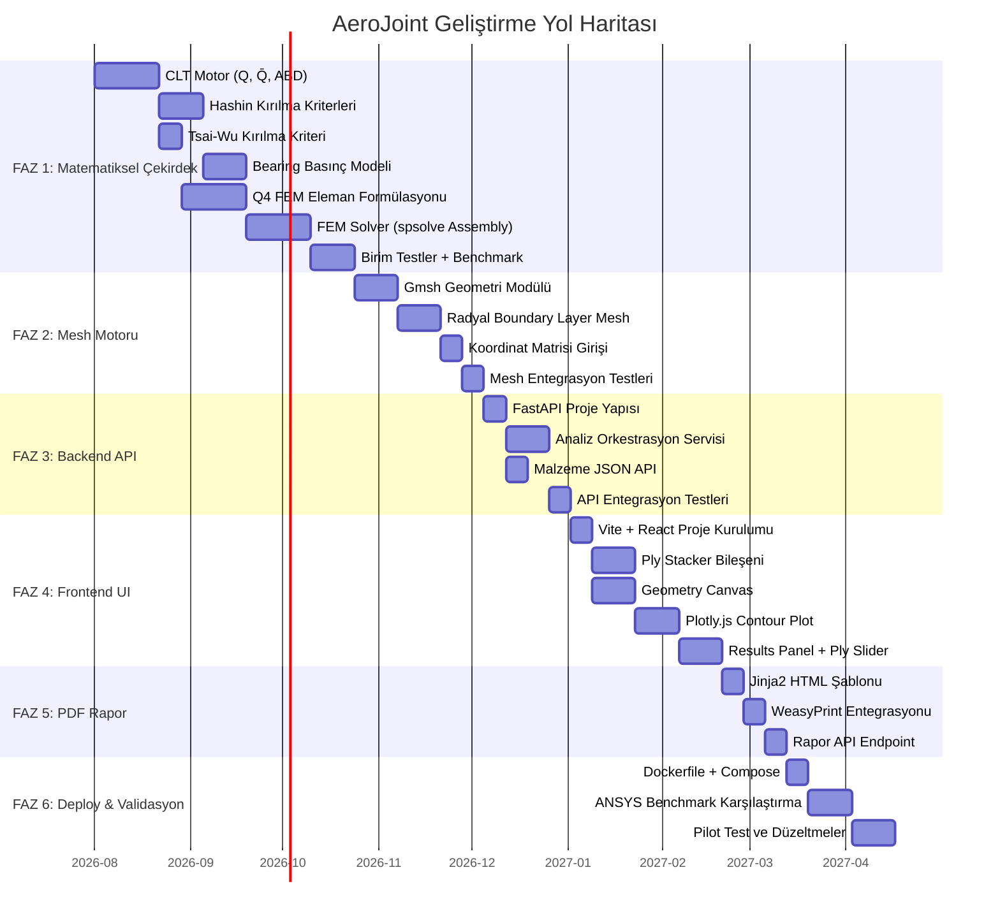

# 🛩️ AeroJoint — Kompozit Bağlantı (Lug & Bolted Joint) Analiz ve Sertifikasyon Yazılımı
## Detaylı İmplementasyon Planı v2.0

> **Vizyon**: MIL-HDBK-17 / CMH-17 standartlarında, ANSYS ACP ile boy ölçüşen, 2-5 saniyede sonuç veren bulut tabanlı kompozit bağlantı analiz yazılımı.

---

## Kesinleşen Mimari Kararlar

Aşağıdaki 10 kritik karar netleştirilmiştir ve tüm plan bu kararlara göre yapılandırılmıştır:

| # | Karar | Seçim | Gerekçe |
|---|-------|-------|---------|
| 1 | Geliştirme Sırası | **Çekirdek Öncelikli (FAZ 1)** | Hesaplama %1 hatalıysa ürün değersiz |
| 2 | Eleman Tipi | **Q4 + Radyal Sıklaştırma** (Q8 opsiyonel) | 4-6 katman radyal Q4 ile %0.5 yakınsama |
| 3 | Malzeme Kütüphanesi | **Harici JSON Dosyası** | Özel prepreg eklemeye olanak tanır |
| 4 | DXF Import | **v1.1'e ertelendi** | Edge case riski yüksek, koordinat matrisi yeterli |
| 5 | Async İşleme | **Senkron FastAPI** | 1.5-3 sn süre için Celery over-engineering |
| 6 | Deployment | **Docker MVP** (lokal başla, bulut-hazır) | Savunma sanayi On-Premise gereksinimi |
| 7 | Görselleştirme | **Plotly.js (WebGL)** | 5K-15K eleman için 60 FPS yeterli |
| 8 | Çözücü | **spsolve (SuperLU Direct)** | 20K DOF'a kadar iteratiften hızlı |
| 9 | Hasar Kriteri | **Birincil: Hashin, İkincil: Tsai-Wu** | FAA/EASA mod ayrımı zorunluluğu |
| 10 | PDF Motoru | **WeasyPrint + Jinja2** | HTML/CSS ile estetik kurumsal rapor |

---

## İçindekiler

1. [Proje Genel Bakış ve Mimari](#1-proje-genel-bakış-ve-mimari)
2. [Dizin Yapısı ve Teknoloji Haritası](#2-dizin-yapısı-ve-teknoloji-haritası)
3. [FAZ 1: Matematiksel Çekirdek ve Solver Engine](#3-faz-1-matematiksel-çekirdek-ve-solver-engine)
4. [FAZ 2: Geometri ve Otomatik Mesh Motoru](#4-faz-2-geometri-ve-otomatik-mesh-motoru)
5. [FAZ 3: Backend API Katmanı](#5-faz-3-backend-api-katmanı)
6. [FAZ 4: Frontend Web UI/UX](#6-faz-4-frontend-web-uiux)
7. [FAZ 5: Sertifikasyon Raporu ve PDF Çıktısı](#7-faz-5-sertifikasyon-raporu-ve-pdf-çıktısı)
8. [FAZ 6: Validasyon, Docker ve Deployment](#8-faz-6-validasyon-docker-ve-deployment)
9. [Test ve Doğrulama Stratejisi](#9-test-ve-doğrulama-stratejisi)
10. [Geliştirme Yol Haritası ve Zaman Çizelgesi](#10-geliştirme-yol-haritası-ve-zaman-çizelgesi)

---

## 1. Proje Genel Bakış ve Mimari

### 1.1 Sistem Mimarisi



### 1.2 Veri Akışı (Data Flow)



### 1.3 Temel Performans Hedefleri

| Metrik | Hedef | ANSYS Karşılığı |
|--------|-------|-----------------|
| Mesh Oluşturma | < 1 saniye | 35-60 dakika |
| FEM Çözüm (10K DoF, spsolve) | < 2 saniye | 4.5 dakika |
| Toplam Analiz (senkron) | 2-5 saniye | 1-2 saat |
| Doğruluk (Max Bearing Stress) | < %1 fark | Referans |
| PDF Rapor Üretimi (WeasyPrint) | < 3 saniye | Manuel (Word) |

---

## 2. Dizin Yapısı ve Teknoloji Haritası

### 2.1 Proje Kök Dizin Yapısı

```
Kompozit Bağlantı (Lug & Bolted Joint) Analiz ve Sertifikasyon Yazılımı/
│
├── backend/                          # Python FastAPI Arka Plan
│   ├── app/
│   │   ├── __init__.py
│   │   ├── main.py                   # FastAPI uygulama başlatıcı
│   │   ├── config.py                 # Ayarlar (Pydantic BaseSettings)
│   │   │
│   │   ├── api/                      # REST API Endpoint'leri
│   │   │   ├── __init__.py
│   │   │   ├── routes/
│   │   │   │   ├── __init__.py
│   │   │   │   ├── analysis.py       # POST /api/analysis/run
│   │   │   │   ├── geometry.py       # POST /api/geometry/mesh
│   │   │   │   ├── materials.py      # GET/POST /api/materials
│   │   │   │   └── reports.py        # GET /api/reports/{id}/pdf
│   │   │   └── deps.py              # Bağımlılık enjeksiyonu
│   │   │
│   │   ├── models/                   # Pydantic İstek/Yanıt Modelleri
│   │   │   ├── __init__.py
│   │   │   ├── analysis.py
│   │   │   ├── geometry.py
│   │   │   ├── materials.py
│   │   │   └── reports.py
│   │   │
│   │   ├── core/                     # Mühendislik Hesap Çekirdeği
│   │   │   ├── __init__.py
│   │   │   ├── clt.py                # Klasik Laminat Teorisi
│   │   │   ├── fem_solver.py         # FEM Montaj & spsolve Çözücü
│   │   │   ├── fem_elements.py       # Q4 Eleman Formülasyonu (+ Q8 opsiyonel)
│   │   │   ├── mesh_engine.py        # Gmsh Arayüzü
│   │   │   ├── bearing.py            # Kosinüs Dağılımlı Basınç Modeli
│   │   │   ├── failure.py            # Hashin (birincil) + Tsai-Wu (ikincil)
│   │   │   ├── boundary.py           # Sınır Koşulları Yöneticisi
│   │   │   └── materials_db.py       # JSON Malzeme Kütüphanesi Yöneticisi
│   │   │
│   │   ├── services/                 # İş Mantığı Orkestrasyon
│   │   │   ├── __init__.py
│   │   │   ├── analysis_service.py   # Ana analiz iş akışı (senkron)
│   │   │   └── report_service.py     # Rapor oluşturma servisi
│   │   │
│   │   └── reports/                  # WeasyPrint PDF Şablonları
│   │       ├── __init__.py
│   │       ├── generator.py          # WeasyPrint PDF oluşturucu
│   │       ├── templates/
│   │       │   ├── base.html         # Ana HTML şablon
│   │       │   ├── report.html       # Sertifikasyon raporu Jinja2 şablonu
│   │       │   └── styles.css        # Rapor CSS stilleri
│   │       └── assets/
│   │           └── logo.png
│   │
│   ├── data/                         # Harici Veri Dosyaları
│   │   └── materials.json            # Havacılık malzeme kütüphanesi
│   │
│   ├── tests/                        # Birim ve Entegrasyon Testleri
│   │   ├── __init__.py
│   │   ├── test_clt.py
│   │   ├── test_fem_solver.py
│   │   ├── test_fem_elements.py
│   │   ├── test_bearing.py
│   │   ├── test_failure.py
│   │   ├── test_mesh_engine.py
│   │   ├── test_materials_db.py
│   │   ├── test_analysis_service.py
│   │   ├── test_api.py
│   │   └── fixtures/                 # Test verileri
│   │       ├── benchmark_ansys.json
│   │       └── test_materials.json
│   │
│   ├── requirements.txt
│   ├── pyproject.toml
│   ├── Dockerfile                    # Docker imajı
│   └── README.md
│
├── frontend/                         # React + TypeScript + Vite Ön Yüz
│   ├── src/
│   │   ├── App.tsx
│   │   ├── main.tsx
│   │   ├── index.css                 # Global tasarım sistemi (koyu tema)
│   │   │
│   │   ├── components/
│   │   │   ├── Layout/
│   │   │   │   ├── Header.tsx
│   │   │   │   ├── Sidebar.tsx
│   │   │   │   ├── MainLayout.tsx
│   │   │   │   └── Layout.css
│   │   │   │
│   │   │   ├── PlyStacker/
│   │   │   │   ├── PlyStacker.tsx    # Katman dizici bileşen
│   │   │   │   ├── PlyRow.tsx
│   │   │   │   ├── PlyPreview3D.tsx
│   │   │   │   └── PlyStacker.css
│   │   │   │
│   │   │   ├── GeometryEditor/
│   │   │   │   ├── GeometryCanvas.tsx    # 2D geometri çizim tuvali
│   │   │   │   ├── HoleConfigurator.tsx
│   │   │   │   ├── GeometryToolbar.tsx
│   │   │   │   └── GeometryEditor.css
│   │   │   │
│   │   │   ├── StressViewer/
│   │   │   │   ├── ContourPlot.tsx       # Plotly.js mesh3d gerilme haritası
│   │   │   │   ├── PlySlider.tsx         # Katmanlar arası gezinme
│   │   │   │   ├── ColorScaleLegend.tsx
│   │   │   │   └── StressViewer.css
│   │   │   │
│   │   │   ├── ResultsPanel/
│   │   │   │   ├── ResultsSummary.tsx
│   │   │   │   ├── FailureTable.tsx
│   │   │   │   ├── MoSDisplay.tsx
│   │   │   │   └── ResultsPanel.css
│   │   │   │
│   │   │   └── common/
│   │   │       ├── Button.tsx
│   │   │       ├── Input.tsx
│   │   │       ├── Modal.tsx
│   │   │       ├── LoadingSpinner.tsx
│   │   │       └── common.css
│   │   │
│   │   ├── api/
│   │   │   ├── client.ts             # Axios konfigürasyonu
│   │   │   └── analysisApi.ts        # API çağrıları
│   │   │
│   │   ├── types/
│   │   │   ├── analysis.ts
│   │   │   ├── geometry.ts
│   │   │   └── materials.ts
│   │   │
│   │   ├── hooks/
│   │   │   ├── useAnalysis.ts
│   │   │   └── useGeometry.ts
│   │   │
│   │   └── utils/
│   │       ├── colorScales.ts
│   │       ├── meshUtils.ts
│   │       └── validators.ts
│   │
│   ├── public/
│   ├── index.html
│   ├── vite.config.ts
│   ├── tsconfig.json
│   └── package.json
│
├── docker-compose.yml                # Orchestration (frontend + backend)
├── Dockerfile.frontend               # Frontend Docker imajı
├── docs/                             # Proje Dokümantasyonu
│   ├── math_reference.md
│   ├── api_reference.md
│   └── validation_report.md
│
├── IMPLEMENTATION_PLAN.md            # Bu dosya
└── README.md
```

### 2.2 Teknoloji Yığını (Kesinleşmiş)

| Katman | Teknoloji | Versiyon | Seçim Gerekçesi |
|--------|-----------|----------|-----------------|
| **Frontend** | React + TypeScript | React 18+ | Tip güvenliği, bileşen mimarisi |
| **Build** | Vite | 5+ | Hızlı HMR, modern bundling |
| **Görselleştirme** | **Plotly.js (WebGL)** | 2.x | 5K-15K eleman için 60 FPS, React uyumlu |
| **2D Çizim** | HTML5 Canvas API | — | Geometri editörü için |
| **Backend** | Python FastAPI | 0.115+ | **Senkron** API, Pydantic validasyon |
| **Mesh** | Gmsh Python API | 4.x | Parametrik mesh, boundary layer |
| **Çözücü** | **spsolve (SuperLU Direct)** | SciPy 1.14+ | 20K DOF'a kadar en hızlı |
| **Hasar Kriteri** | **Hashin (birincil) + Tsai-Wu (ikincil)** | — | FAA/EASA mod ayrımı |
| **PDF Rapor** | **WeasyPrint + Jinja2** | 62+ | HTML/CSS ile estetik rapor |
| **Malzeme DB** | **Harici JSON** | — | Özel prepreg ekleme esnekliği |
| **Container** | **Docker + Docker Compose** | — | On-premise deployment |
| **Test** | pytest | 8+ | Python birim testleri |

---

## 3. FAZ 1: Matematiksel Çekirdek ve Solver Engine

> **Hedef**: Grafiksiz ama kusursuz hesap yapan, pytest ile NASA/MIL-HDBK-17 benchmark testlerini geçen saf bir Python kütüphanesi.  
> **Öncelik**: ⭐ EN YÜKSEK — Her şeyin temeli.

### 3.1 Modül: Harici Malzeme Kütüphanesi — `data/materials.json` + `core/materials_db.py`

#### 3.1.1 JSON Malzeme Dosyası

```json
// backend/data/materials.json
{
  "version": "1.0",
  "description": "AeroJoint Havacılık Kompozit Malzeme Kütüphanesi",
  "materials": {
    "T300_5208": {
      "name": "T300/5208 Carbon/Epoxy",
      "category": "Carbon/Epoxy",
      "source": "MIL-HDBK-17-2F, Table 2.4.1",
      "elastic": {
        "E1": 181000,
        "E2": 10300,
        "G12": 7170,
        "nu12": 0.28
      },
      "strength": {
        "Xt": 1500,
        "Xc": 1500,
        "Yt": 40,
        "Yc": 246,
        "S12": 68,
        "S23": null
      },
      "ply_thickness": 0.125,
      "density": 1.6,
      "notes": "Standart havacılık test malzemesi"
    },
    "AS4_3501_6": {
      "name": "AS4/3501-6 Carbon/Epoxy",
      "category": "Carbon/Epoxy",
      "source": "CMH-17-2G, Table 2.3.1",
      "elastic": {
        "E1": 147000,
        "E2": 10300,
        "G12": 7000,
        "nu12": 0.27
      },
      "strength": {
        "Xt": 2280,
        "Xc": 1440,
        "Yt": 57,
        "Yc": 228,
        "S12": 71,
        "S23": null
      },
      "ply_thickness": 0.188,
      "density": 1.58,
      "notes": "Yaygın havacılık yapısal prepreg"
    },
    "IM7_8552": {
      "name": "IM7/8552 Carbon/Epoxy",
      "category": "Carbon/Epoxy",
      "source": "CMH-17-2G, Table 2.3.2",
      "elastic": {
        "E1": 171420,
        "E2": 9080,
        "G12": 5290,
        "nu12": 0.32
      },
      "strength": {
        "Xt": 2326,
        "Xc": 1200,
        "Yt": 62.3,
        "Yc": 199.8,
        "S12": 92.3,
        "S23": null
      },
      "ply_thickness": 0.131,
      "density": 1.57,
      "notes": "Yüksek performanslı ara modüllü elyaf sistemi"
    },
    "E_GLASS_EPOXY": {
      "name": "E-Glass/Epoxy",
      "category": "Glass/Epoxy",
      "source": "Daniel & Ishai Tablo 2.1",
      "elastic": {
        "E1": 39000,
        "E2": 8600,
        "G12": 3800,
        "nu12": 0.28
      },
      "strength": {
        "Xt": 1080,
        "Xc": 620,
        "Yt": 39,
        "Yc": 128,
        "S12": 89,
        "S23": null
      },
      "ply_thickness": 0.25,
      "density": 2.1,
      "notes": "Cam elyaf standart test malzemesi"
    }
  }
}
```

#### 3.1.2 Malzeme Yöneticisi

```python
# backend/app/core/materials_db.py
"""
Harici JSON Malzeme Kütüphanesi Yöneticisi.

Neden JSON? TUSAŞ/Baykar mühendisleri kendi gizli prepreg malzemelerini
(özel reçineli karbon fiber) kodla uğraşmadan kütüphaneye ekleyebilsin.
"""
import json
import os
from pathlib import Path
from typing import Optional
from .clt import OrthotropicMaterial

# Varsayılan malzeme dosyası yolu
DEFAULT_MATERIALS_PATH = Path(__file__).parent.parent.parent / "data" / "materials.json"


class MaterialsDB:
    """JSON tabanlı malzeme kütüphanesi."""
    
    def __init__(self, json_path: Optional[str] = None):
        self.json_path = Path(json_path) if json_path else DEFAULT_MATERIALS_PATH
        self._materials = {}
        self._load()
    
    def _load(self):
        """JSON dosyasını yükle."""
        if not self.json_path.exists():
            raise FileNotFoundError(
                f"Malzeme kütüphanesi bulunamadı: {self.json_path}"
            )
        
        with open(self.json_path, 'r', encoding='utf-8') as f:
            data = json.load(f)
        
        self._materials = data.get('materials', {})
    
    def list_materials(self) -> list[dict]:
        """Tüm malzemelerin listesini döndür."""
        return [
            {
                'id': mat_id,
                'name': mat_data['name'],
                'category': mat_data.get('category', 'Unknown'),
                'source': mat_data.get('source', ''),
                'ply_thickness': mat_data.get('ply_thickness', 0.125)
            }
            for mat_id, mat_data in self._materials.items()
        ]
    
    def get_material(self, material_id: str) -> OrthotropicMaterial:
        """Belirtilen ID ile malzemeyi OrthotropicMaterial nesnesine dönüştür."""
        if material_id not in self._materials:
            available = ', '.join(self._materials.keys())
            raise ValueError(
                f"Malzeme '{material_id}' bulunamadı. "
                f"Mevcut malzemeler: {available}"
            )
        
        mat = self._materials[material_id]
        elastic = mat['elastic']
        strength = mat['strength']
        
        return OrthotropicMaterial(
            name=mat['name'],
            E1=elastic['E1'],
            E2=elastic['E2'],
            G12=elastic['G12'],
            nu12=elastic['nu12'],
            Xt=strength['Xt'],
            Xc=strength['Xc'],
            Yt=strength['Yt'],
            Yc=strength['Yc'],
            S12=strength['S12'],
            S23=strength.get('S23')
        )
    
    def add_material(self, material_id: str, material_data: dict) -> bool:
        """
        Yeni bir malzeme ekle ve JSON dosyasını güncelle.
        
        Bu yöntem sayesinde mühendisler kendi özel prepreg malzemelerini
        yazılımı yeniden derlemeden ekleyebilir.
        """
        if material_id in self._materials:
            raise ValueError(f"'{material_id}' zaten mevcut. Güncellemek için update_material kullanın.")
        
        # Gerekli alanları doğrula
        required_elastic = ['E1', 'E2', 'G12', 'nu12']
        required_strength = ['Xt', 'Xc', 'Yt', 'Yc', 'S12']
        
        elastic = material_data.get('elastic', {})
        strength = material_data.get('strength', {})
        
        for field in required_elastic:
            if field not in elastic:
                raise ValueError(f"Eksik elastik özellik: {field}")
        
        for field in required_strength:
            if field not in strength:
                raise ValueError(f"Eksik mukavemet özelliği: {field}")
        
        # Termodinamik tutarlılık kontrolü
        nu21 = elastic['nu12'] * elastic['E2'] / elastic['E1']
        if elastic['nu12'] * nu21 >= 1.0:
            raise ValueError("Termodinamik tutarsızlık: ν12·ν21 ≥ 1")
        
        self._materials[material_id] = material_data
        self._save()
        return True
    
    def _save(self):
        """Güncel malzeme verisini JSON dosyasına yaz."""
        data = {
            'version': '1.0',
            'description': 'AeroJoint Havacılık Kompozit Malzeme Kütüphanesi',
            'materials': self._materials
        }
        
        with open(self.json_path, 'w', encoding='utf-8') as f:
            json.dump(data, f, indent=2, ensure_ascii=False)
```

---

### 3.2 Modül: Klasik Laminat Teorisi (CLT) — `core/clt.py`

#### 3.2.1 Veri Sınıfları

```python
# backend/app/core/clt.py
import numpy as np
from dataclasses import dataclass, field
from typing import List, Optional

@dataclass
class OrthotropicMaterial:
    """Tek yönlü (UD) kompozit katman malzeme özellikleri."""
    name: str
    E1: float          # Elyaf doğrultusunda elastisite modülü (MPa)
    E2: float          # Elyafa dik elastisite modülü (MPa)
    G12: float         # Düzlem-içi kayma modülü (MPa)
    nu12: float        # Majör Poisson oranı
    
    # Mukavemet sınırları (Allowables) — pozitif değerler
    Xt: float          # Elyaf yönü çekme mukavemeti (MPa)
    Xc: float          # Elyaf yönü basma mukavemeti (MPa)
    Yt: float          # Elyafa dik çekme mukavemeti (MPa)
    Yc: float          # Elyafa dik basma mukavemeti (MPa)
    S12: float         # Düzlem-içi kayma mukavemeti (MPa)
    S23: Optional[float] = None  # Enine kayma mukavemeti (opsiyonel)
    
    @property
    def nu21(self) -> float:
        """Karşılıklılık ilişkisinden hesaplanan minör Poisson oranı."""
        return self.nu12 * self.E2 / self.E1
    
    def validate(self) -> bool:
        """Malzeme tutarlılık kontrolü."""
        assert self.E1 > 0 and self.E2 > 0 and self.G12 > 0
        assert 0 < self.nu12 < 1
        assert self.nu12 * self.nu21 < 1, "Termodinamik tutarlılık: nu12*nu21 < 1"
        return True


@dataclass
class Ply:
    """Tek bir kompozit katman."""
    material: OrthotropicMaterial
    angle: float           # Elyaf açısı (derece)
    thickness: float       # Katman kalınlığı (mm)
    ply_id: int = 0


@dataclass
class Laminate:
    """Çok katmanlı kompozit laminat dizilimi."""
    plies: List[Ply]
    
    @property
    def total_thickness(self) -> float:
        return sum(ply.thickness for ply in self.plies)
    
    @property
    def n_plies(self) -> int:
        return len(self.plies)
    
    @property
    def is_symmetric(self) -> bool:
        """Simetri kontrolü: dizilim orta düzleme göre simetrik mi?"""
        n = self.n_plies
        for i in range(n // 2):
            if (self.plies[i].angle != self.plies[n - 1 - i].angle or
                self.plies[i].thickness != self.plies[n - 1 - i].thickness):
                return False
        return True
    
    @property
    def layup_notation(self) -> str:
        """İnsan okunabilir katman notasyonu üret. Örn: [0₂/±45₂/90]s"""
        # Basitleştirilmiş notasyon
        angles = [ply.angle for ply in self.plies]
        if self.is_symmetric:
            half = angles[:self.n_plies // 2]
            return f"[{'/'.join(str(int(a)) + '°' for a in half)}]s"
        return f"[{'/'.join(str(int(a)) + '°' for a in angles)}]"
    
    def get_z_coordinates(self) -> List[float]:
        """Her katmanın alt ve üst z koordinatlarını hesapla (orta düzlemden)."""
        h = self.total_thickness
        z = [-h / 2]
        for ply in self.plies:
            z.append(z[-1] + ply.thickness)
        return z
```

#### 3.2.2 CLT Hesap Motoru

```python
class CLTEngine:
    """
    Klasik Laminat Teorisi hesap motoru.
    
    Hesap akışı:
    1. Her katman için [Q] → [Q̄(θ)] hesapla
    2. z koordinatları üzerinden [A], [B], [D] biriktir
    3. ABD⁻¹ ile orta düzlem gerinim ve eğrilikleri çöz
    4. Her katmanın alt/orta/üst noktasında σ₁, σ₂, τ₁₂ hesapla
    """
    
    @staticmethod
    def compute_Q(material: OrthotropicMaterial) -> np.ndarray:
        """
        On-axis indirilmiş rijitlik matrisi [Q] (3×3).
        
        Q₁₁ = E₁/(1-ν₁₂·ν₂₁)
        Q₂₂ = E₂/(1-ν₁₂·ν₂₁)
        Q₁₂ = ν₁₂·E₂/(1-ν₁₂·ν₂₁)
        Q₆₆ = G₁₂
        """
        E1, E2 = material.E1, material.E2
        nu12, nu21 = material.nu12, material.nu21
        G12 = material.G12
        
        denom = 1.0 - nu12 * nu21
        
        Q = np.array([
            [E1 / denom,       nu12 * E2 / denom, 0.0],
            [nu12 * E2 / denom, E2 / denom,        0.0],
            [0.0,               0.0,                G12]
        ])
        return Q
    
    @staticmethod
    def compute_Qbar(Q: np.ndarray, theta_deg: float) -> np.ndarray:
        """
        Dönüştürülmüş rijitlik matrisi [Q̄] (3×3).
        
        Açık formüller ile hesaplanır (dönüşüm matrisi yerine doğrudan).
        """
        theta = np.radians(theta_deg)
        m = np.cos(theta)
        n = np.sin(theta)
        
        m2, n2, mn = m**2, n**2, m * n
        m4, n4 = m**4, n**4
        m2n2 = m2 * n2
        
        Q11, Q12, Q22, Q66 = Q[0,0], Q[0,1], Q[1,1], Q[2,2]
        
        Qbar = np.zeros((3, 3))
        Qbar[0,0] = Q11*m4 + 2*(Q12 + 2*Q66)*m2n2 + Q22*n4
        Qbar[0,1] = (Q11 + Q22 - 4*Q66)*m2n2 + Q12*(m4 + n4)
        Qbar[1,0] = Qbar[0,1]
        Qbar[1,1] = Q11*n4 + 2*(Q12 + 2*Q66)*m2n2 + Q22*m4
        Qbar[0,2] = (Q11 - Q12 - 2*Q66)*m**3*n - (Q22 - Q12 - 2*Q66)*m*n**3
        Qbar[2,0] = Qbar[0,2]
        Qbar[1,2] = (Q11 - Q12 - 2*Q66)*m*n**3 - (Q22 - Q12 - 2*Q66)*m**3*n
        Qbar[2,1] = Qbar[1,2]
        Qbar[2,2] = (Q11 + Q22 - 2*Q12 - 2*Q66)*m2n2 + Q66*(m4 + n4)
        
        return Qbar
    
    @staticmethod
    def compute_ABD(laminate: Laminate) -> tuple[np.ndarray, np.ndarray, np.ndarray]:
        """
        [A], [B], [D] rijitlik matrislerini hesapla.
        
        A_ij = Σₖ Q̄_ij(k) × (zₖ - zₖ₋₁)
        B_ij = ½ Σₖ Q̄_ij(k) × (zₖ² - zₖ₋₁²)
        D_ij = ⅓ Σₖ Q̄_ij(k) × (zₖ³ - zₖ₋₁³)
        """
        A = np.zeros((3, 3))
        B = np.zeros((3, 3))
        D = np.zeros((3, 3))
        
        z_coords = laminate.get_z_coordinates()
        engine = CLTEngine()
        
        for k, ply in enumerate(laminate.plies):
            z_bot = z_coords[k]
            z_top = z_coords[k + 1]
            
            Q = engine.compute_Q(ply.material)
            Qbar = engine.compute_Qbar(Q, ply.angle)
            
            A += Qbar * (z_top - z_bot)
            B += 0.5 * Qbar * (z_top**2 - z_bot**2)
            D += (1.0/3.0) * Qbar * (z_top**3 - z_bot**3)
        
        return A, B, D
    
    @staticmethod
    def compute_ABD_inverse(A, B, D) -> np.ndarray:
        """ABD matrisinin tersini al → 6×6 uyum matrisi."""
        ABD = np.block([[A, B], [B, D]])
        return np.linalg.inv(ABD)
    
    @staticmethod
    def transform_stress_to_local(sigma_global: np.ndarray, 
                                   theta_deg: float) -> np.ndarray:
        """
        Global gerilmeleri (σx, σy, τxy) → malzeme koordinatlarına (σ₁, σ₂, τ₁₂).
        {σ_local} = [T(θ)] {σ_global}
        """
        theta = np.radians(theta_deg)
        m = np.cos(theta)
        n = np.sin(theta)
        
        T = np.array([
            [ m**2,  n**2,   2*m*n],
            [ n**2,  m**2,  -2*m*n],
            [-m*n,   m*n,    m**2 - n**2]
        ])
        return T @ sigma_global
    
    @staticmethod
    def compute_ply_stresses(laminate: Laminate, 
                              N: np.ndarray,
                              M: np.ndarray) -> list[dict]:
        """
        Her katmandaki gerilmeleri hesapla.
        
        Adımlar:
        1. ABD⁻¹ ile orta düzlem gerinim ve eğrilikleri çöz
        2. Her katmanın alt/orta/üst z noktasında global gerinimleri hesapla
        3. Q̄ ile global gerilmelere dönüştür
        4. T(θ) ile malzeme koordinatlarına (σ₁, σ₂, τ₁₂) dönüştür
        """
        engine = CLTEngine()
        A, B, D = engine.compute_ABD(laminate)
        abd_inv = engine.compute_ABD_inverse(A, B, D)
        
        load_vector = np.concatenate([N, M])
        deformation = abd_inv @ load_vector
        epsilon_0 = deformation[:3]
        kappa = deformation[3:]
        
        z_coords = laminate.get_z_coordinates()
        results = []
        
        for k, ply in enumerate(laminate.plies):
            z_bot = z_coords[k]
            z_top = z_coords[k + 1]
            z_mid = (z_bot + z_top) / 2.0
            
            Q = engine.compute_Q(ply.material)
            Qbar = engine.compute_Qbar(Q, ply.angle)
            
            ply_result = {'ply_id': k, 'angle': ply.angle, 'positions': {}}
            
            for label, z in [('bottom', z_bot), ('middle', z_mid), ('top', z_top)]:
                epsilon_global = epsilon_0 + z * kappa
                sigma_global = Qbar @ epsilon_global
                sigma_local = engine.transform_stress_to_local(sigma_global, ply.angle)
                
                ply_result['positions'][label] = {
                    'epsilon_global': epsilon_global.tolist(),
                    'sigma_global': sigma_global.tolist(),
                    'sigma_local': sigma_local.tolist(),
                    'z': z
                }
            
            results.append(ply_result)
        
        return results
```

---

### 3.3 Modül: Kırılma Kriterleri Motoru — `core/failure.py`

> **Karar**: Birincil kriter **Hashin** (FAA/EASA mod ayrımı), ikincil kriter **Tsai-Wu** (genel zarf kontrolü).

```python
# backend/app/core/failure.py
"""
Havacılık Hasar/Kırılma Kriterleri Motoru.

Birincil: Hashin (1980) — 4 bağımsız hasar modu
İkincil: Tsai-Wu — Genel eliptik etkileşim katsayısı

Hashin NEDEN birincil?
→ FAA/EASA, bir parçanın sadece "kırıldığını" değil, 
  "hangi moddan kırıldığını" (elyaf mı koptu? matris mi çatladı?) bilmek ister.
  Hashin bu ayrımı yaptığı için havacılıkta zorunlu kriterdir.

Tsai-Wu NEDEN ikincil?
→ Genel bir ön denetim (screening) olarak çalışır. Tek bir FI değeri
  verir, bu da hızlı mühendislik kararı almayı kolaylaştırır.
"""
import numpy as np
from dataclasses import dataclass
from .clt import OrthotropicMaterial

@dataclass
class FailureResult:
    """Tek bir katmandaki kırılma analizi sonucu."""
    ply_id: int
    angle: float
    
    # Hashin (BİRİNCİL)
    hashin_fiber_tension: float = 0.0
    hashin_fiber_compression: float = 0.0
    hashin_matrix_tension: float = 0.0
    hashin_matrix_compression: float = 0.0
    hashin_max_fi: float = 0.0
    hashin_failure_mode: str = "None"
    
    # Tsai-Wu (İKİNCİL)
    tsai_wu_fi: float = 0.0
    
    # Güvenlik Marjı — Hashin üzerinden hesaplanır (birincil)
    mos_hashin: float = float('inf')
    mos_tsai_wu: float = float('inf')
    min_mos: float = float('inf')
    governing_criterion: str = "Hashin"
    
    # Durum
    is_failed: bool = False


class FailureCriteriaEngine:
    """Katman katman Hashin ve Tsai-Wu analizi yapar."""
    
    @staticmethod
    def hashin_criteria(sigma_1: float, sigma_2: float, tau_12: float,
                        material: OrthotropicMaterial) -> dict:
        """
        Hashin Kırılma Kriterleri (1980).
        
        4 bağımsız hasar modu:
        
        1) Elyaf Çekme (σ₁ > 0):  FI_ft = (σ₁/Xt)² + (τ₁₂/S₁₂)²
        2) Elyaf Basma (σ₁ < 0):  FI_fc = (σ₁/Xc)²
        3) Matris Çekme (σ₂ > 0): FI_mt = (σ₂/Yt)² + (τ₁₂/S₁₂)²
        4) Matris Basma (σ₂ < 0): FI_mc = (σ₂/Yc)² + (τ₁₂/S₁₂)²
        
        FI ≥ 1.0 → KIRILMA
        """
        Xt, Xc = material.Xt, material.Xc
        Yt, Yc = material.Yt, material.Yc
        S12 = material.S12
        
        fi_ft = (sigma_1 / Xt)**2 + (tau_12 / S12)**2 if sigma_1 > 0 else 0.0
        fi_fc = (sigma_1 / Xc)**2 if sigma_1 < 0 else 0.0
        fi_mt = (sigma_2 / Yt)**2 + (tau_12 / S12)**2 if sigma_2 > 0 else 0.0
        
        fi_mc = 0.0
        if sigma_2 < 0:
            if material.S23 is not None:
                S23 = material.S23
                fi_mc = ((sigma_2 / (2 * S23))**2 + 
                         ((Yc / (2 * S23))**2 - 1) * (sigma_2 / Yc) + 
                         (tau_12 / S12)**2)
            else:
                fi_mc = (sigma_2 / Yc)**2 + (tau_12 / S12)**2
        
        modes = {
            'Fiber Tension': fi_ft,
            'Fiber Compression': fi_fc,
            'Matrix Tension': fi_mt,
            'Matrix Compression': fi_mc
        }
        
        max_fi = max(modes.values())
        dominant_mode = max(modes, key=modes.get) if max_fi > 0 else "None"
        
        return {
            'fiber_tension': fi_ft,
            'fiber_compression': fi_fc,
            'matrix_tension': fi_mt,
            'matrix_compression': fi_mc,
            'max_fi': max_fi,
            'dominant_mode': dominant_mode
        }
    
    @staticmethod
    def tsai_wu_criterion(sigma_1: float, sigma_2: float, tau_12: float,
                           material: OrthotropicMaterial) -> dict:
        """
        Tsai-Wu Etkileşim Kırılma Kriteri (İKİNCİL).
        
        F₁σ₁ + F₂σ₂ + F₁₁σ₁² + F₂₂σ₂² + F₆₆τ₁₂² + 2F₁₂σ₁σ₂ = 1
        
        FI = 1/R → R çözümü: a·R² + b·R - 1 = 0
        """
        Xt, Xc = material.Xt, material.Xc
        Yt, Yc = material.Yt, material.Yc
        S12 = material.S12
        
        F1 = 1.0/Xt - 1.0/Xc
        F2 = 1.0/Yt - 1.0/Yc
        F11 = 1.0 / (Xt * Xc)
        F22 = 1.0 / (Yt * Yc)
        F66 = 1.0 / (S12**2)
        F12 = -0.5 * np.sqrt(F11 * F22)
        
        a = (F11 * sigma_1**2 + F22 * sigma_2**2 + F66 * tau_12**2 + 
             2 * F12 * sigma_1 * sigma_2)
        b = F1 * sigma_1 + F2 * sigma_2
        
        if abs(a) < 1e-15:
            R = 1.0 / b if abs(b) > 1e-15 else float('inf')
        else:
            discriminant = b**2 + 4 * a
            R = (-b + np.sqrt(max(0, discriminant))) / (2 * a) if discriminant >= 0 else float('inf')
        
        fi = 1.0 / R if R > 0 else float('inf')
        
        return {'fi': fi, 'strength_ratio': R}
    
    @staticmethod
    def compute_margin_of_safety(failure_index: float) -> float:
        """
        Güvenlik Marjı: MoS = (1/FI) - 1
        MoS > 0 → GEÇTİ | MoS < 0 → KALDI
        """
        if failure_index <= 0:
            return float('inf')
        return (1.0 / failure_index) - 1.0
    
    def evaluate_ply(self, sigma_1: float, sigma_2: float, tau_12: float,
                     material: OrthotropicMaterial, ply_id: int, 
                     angle: float) -> FailureResult:
        """Tek bir katmanı Hashin (birincil) + Tsai-Wu (ikincil) ile değerlendir."""
        hashin = self.hashin_criteria(sigma_1, sigma_2, tau_12, material)
        tsai_wu = self.tsai_wu_criterion(sigma_1, sigma_2, tau_12, material)
        
        mos_h = self.compute_margin_of_safety(hashin['max_fi'])
        mos_tw = self.compute_margin_of_safety(tsai_wu['fi'])
        
        # Birincil kriter: Hashin
        # İkincil: Tsai-Wu sadece ek bilgi olarak sunulur
        # MoS kararı Hashin üzerinden verilir
        min_mos = mos_h  # Hashin birincil
        governing = "Hashin"
        
        # Eğer Tsai-Wu daha kritikse, bunu da belirt ama karar Hashin'de
        if mos_tw < mos_h:
            governing = "Hashin (Tsai-Wu daha kritik: MoS={:.3f})".format(mos_tw)
        
        return FailureResult(
            ply_id=ply_id,
            angle=angle,
            hashin_fiber_tension=hashin['fiber_tension'],
            hashin_fiber_compression=hashin['fiber_compression'],
            hashin_matrix_tension=hashin['matrix_tension'],
            hashin_matrix_compression=hashin['matrix_compression'],
            hashin_max_fi=hashin['max_fi'],
            hashin_failure_mode=hashin['dominant_mode'],
            tsai_wu_fi=tsai_wu['fi'],
            mos_hashin=mos_h,
            mos_tsai_wu=mos_tw,
            min_mos=min_mos,
            governing_criterion=governing,
            is_failed=(min_mos < 0)
        )
```

---

### 3.4 Modül: Kosinüs Dağılımlı Bearing Basınç Modeli — `core/bearing.py`

```python
# backend/app/core/bearing.py
"""
Havacılık Standardı: Kosinüs Dağılımlı Radyal Basınç Modeli.

Pimin deliğe uyguladığı yük, deliğin yük yönündeki yarı çevresine
(-π/2 ≤ θ ≤ π/2) kosinüs dağılımıyla uygulanır:

    σᵣ(θ) = (4P)/(π·D·t) · cos(θ)   |θ| ≤ π/2
    σᵣ(θ) = 0                         |θ| > π/2

Bu sayede nonlinear contact iterasyonu yerine linear static çözüm yapılır.
Hesap süresi: dakikalar → milisaniyeler.
FAA/EASA sertifikasyonunda kabul görmüş yöntemdir.
"""
import numpy as np
from dataclasses import dataclass

@dataclass
class BearingLoad:
    """Tek bir delik üzerindeki yataklama yükü tanımı."""
    hole_x: float
    hole_y: float
    diameter: float
    load_magnitude: float
    load_angle: float  # derece, x-ekseni pozitif yönden


class BearingPressureModel:
    
    @staticmethod
    def compute_peak_pressure(load: float, diameter: float, 
                               thickness: float) -> float:
        """p₀ = 4P / (π·D·t)"""
        return (4.0 * load) / (np.pi * diameter * thickness)
    
    @staticmethod
    def compute_average_bearing_stress(load: float, diameter: float,
                                        thickness: float) -> float:
        """σ_br = P / (D·t)"""
        return load / (diameter * thickness)
    
    def apply_bearing_loads(self, bearing_load: BearingLoad,
                            hole_boundary_nodes: list[dict],
                            thickness: float) -> dict:
        """
        Delik sınır düğümlerine kosinüs dağılımlı nodal kuvvetler uygula.
        
        Returns: {'node_id': (Fx, Fy), ...}
        """
        P = bearing_load.load_magnitude
        D = bearing_load.diameter
        R = D / 2.0
        cx, cy = bearing_load.hole_x, bearing_load.hole_y
        alpha = np.radians(bearing_load.load_angle)
        
        p0 = self.compute_peak_pressure(P, D, thickness)
        
        # Düğümlerin açısal pozisyonlarını hesapla
        nodes_sorted = []
        for node in hole_boundary_nodes:
            dx = node['x'] - cx
            dy = node['y'] - cy
            phi = np.arctan2(dy, dx)
            theta = np.arctan2(np.sin(phi - alpha), np.cos(phi - alpha))
            nodes_sorted.append({
                'id': node['id'], 'x': node['x'], 'y': node['y'],
                'phi': phi, 'theta': theta
            })
        
        nodes_sorted.sort(key=lambda n: n['phi'])
        n_nodes = len(nodes_sorted)
        nodal_forces = {}
        
        for i, node in enumerate(nodes_sorted):
            theta = node['theta']
            
            if abs(theta) > np.pi / 2:
                nodal_forces[node['id']] = (0.0, 0.0)
                continue
            
            # Tributary arc length
            i_prev = (i - 1) % n_nodes
            i_next = (i + 1) % n_nodes
            
            dphi_prev = nodes_sorted[i]['phi'] - nodes_sorted[i_prev]['phi']
            dphi_next = nodes_sorted[i_next]['phi'] - nodes_sorted[i]['phi']
            
            if dphi_prev < -np.pi: dphi_prev += 2 * np.pi
            if dphi_prev > np.pi: dphi_prev -= 2 * np.pi
            if dphi_next < -np.pi: dphi_next += 2 * np.pi
            if dphi_next > np.pi: dphi_next -= 2 * np.pi
            
            delta_arc = R * (abs(dphi_prev) + abs(dphi_next)) / 2.0
            
            pressure = p0 * np.cos(theta)
            Fr = pressure * thickness * delta_arc
            
            phi = node['phi']
            Fx = Fr * np.cos(phi)
            Fy = Fr * np.sin(phi)
            
            nodal_forces[node['id']] = (Fx, Fy)
        
        return nodal_forces
```

---

### 3.5 Modül: Q4 FEM Eleman Formülasyonu — `core/fem_elements.py`

> **Karar**: İlk sürümde **Q4 + yoğun radyal sıklaştırma**. Q8 opsiyonel olarak ayrı class.

```python
# backend/app/core/fem_elements.py
"""
Sonlu Eleman Formülasyonları.

Birincil: Q4 (4 Düğümlü Lineer İzoparametrik Dörtgen)
  - 2×2 Gauss karelemesi
  - Her düğümde 2 DOF (u, v) → 8×8 Ke matrisi
  - Düzlem gerilme (Plane Stress) formülasyonu

Opsiyonel: Q8 (8 Düğümlü Serendipity Kuadratik)
  - 3×3 Gauss karelemesi  
  - 16×16 Ke matrisi
  - Gerilme yığılması bölgelerinde daha doğru

NEDEN Q4 İLK?
→ Delik etrafına 4-6 katman radyal Q4 eleman attığımızda
  analitik çözüme %0.5 yakınsama sağlanır.
  Q4 ile sistem 1 saniyenin altında çözülür.
"""
import numpy as np


class Q4Element:
    """4 Düğümlü İzoparametrik Dörtgen Eleman."""
    
    GP = 1.0 / np.sqrt(3.0)
    GAUSS_POINTS = [(-GP, -GP), (GP, -GP), (GP, GP), (-GP, GP)]
    GAUSS_WEIGHTS = [1.0, 1.0, 1.0, 1.0]
    N_NODES = 4
    N_DOF = 8  # 4 düğüm × 2 DOF
    
    @staticmethod
    def shape_functions(xi: float, eta: float) -> np.ndarray:
        """N₁..N₄ şekil fonksiyonları."""
        return 0.25 * np.array([
            (1 - xi) * (1 - eta),
            (1 + xi) * (1 - eta),
            (1 + xi) * (1 + eta),
            (1 - xi) * (1 + eta)
        ])
    
    @staticmethod
    def shape_function_derivatives(xi: float, eta: float) -> np.ndarray:
        """dN/dξ ve dN/dη (2×4 matris)."""
        return 0.25 * np.array([
            [-(1 - eta), (1 - eta), (1 + eta), -(1 + eta)],
            [-(1 - xi), -(1 + xi), (1 + xi),   (1 - xi)]
        ])
    
    @classmethod
    def stiffness_matrix(cls, xe: np.ndarray, ye: np.ndarray,
                          C: np.ndarray, thickness: float) -> np.ndarray:
        """
        [Kₑ] = t · ∫∫ [B]ᵀ [C] [B] |det(J)| dξ dη
        2×2 Gauss karelemesi ile.
        """
        Ke = np.zeros((8, 8))
        
        for (xi, eta), w in zip(cls.GAUSS_POINTS, cls.GAUSS_WEIGHTS):
            dN = cls.shape_function_derivatives(xi, eta)
            J = dN @ np.column_stack([xe, ye])
            detJ = np.linalg.det(J)
            
            if detJ <= 0:
                raise ValueError(f"Negatif Jacobian ({detJ:.4f}). Düğüm sırası kontrol edin.")
            
            dN_dxy = np.linalg.inv(J) @ dN
            
            B = np.zeros((3, 8))
            for i in range(4):
                B[0, 2*i]     = dN_dxy[0, i]   # εx
                B[1, 2*i + 1] = dN_dxy[1, i]   # εy
                B[2, 2*i]     = dN_dxy[1, i]   # γxy
                B[2, 2*i + 1] = dN_dxy[0, i]   # γxy
            
            Ke += w * thickness * (B.T @ C @ B) * detJ
        
        return Ke
    
    @classmethod
    def compute_stress(cls, xe: np.ndarray, ye: np.ndarray,
                        ue: np.ndarray, C: np.ndarray) -> np.ndarray:
        """Gauss noktalarındaki gerilmeler: σ = C · B · uₑ"""
        stresses = []
        for (xi, eta), _ in zip(cls.GAUSS_POINTS, cls.GAUSS_WEIGHTS):
            dN = cls.shape_function_derivatives(xi, eta)
            J = dN @ np.column_stack([xe, ye])
            dN_dxy = np.linalg.inv(J) @ dN
            
            B = np.zeros((3, 8))
            for i in range(4):
                B[0, 2*i]     = dN_dxy[0, i]
                B[1, 2*i + 1] = dN_dxy[1, i]
                B[2, 2*i]     = dN_dxy[1, i]
                B[2, 2*i + 1] = dN_dxy[0, i]
            
            stresses.append(C @ B @ ue)
        
        return np.array(stresses)
```

---

### 3.6 Modül: FEM Çözücü — `core/fem_solver.py`

> **Karar**: `scipy.sparse.linalg.spsolve` (SuperLU Direct). 20K DOF'a kadar en hızlı.

```python
# backend/app/core/fem_solver.py
"""
Ortotropik 2D Düzlem Gerilme FEM Çözücüsü.

Çözücü: scipy.sparse.linalg.spsolve (SuperLU Direct Sparse Solver)
Neden Direct? 20.000 DOF'a kadar iteratif çözücülerden (CG) çok daha
hızlı ve hatasızdır. Rijitlik matrisi simetrik pozitif tanımlı olduğu
için SuperLU LU faktorizasyonu tek seferde doğru sonuç verir.

İş akışı:
1. Laminattan efektif [C_eff] = [A] / h
2. COO → CSR sparse montaj
3. Sınır koşulları uygulama (DOF eliminasyonu)
4. spsolve ile doğrudan çözüm
5. Gerilme geri hesabı + düğüm ortalaması
"""
import numpy as np
from scipy import sparse
from scipy.sparse.linalg import spsolve
from dataclasses import dataclass
from .fem_elements import Q4Element
from .clt import CLTEngine, Laminate
import time

@dataclass
class MeshData:
    """Mesh verisi."""
    nodes: np.ndarray           # (N_nodes, 2)
    elements: np.ndarray        # (N_elements, 4) Q4 için
    element_type: str           # 'Q4'
    boundary_nodes: dict
    hole_boundary_nodes: list

@dataclass  
class FEMResult:
    """FEM çözüm sonuçları."""
    displacements: np.ndarray
    element_stresses: list
    nodal_stresses: np.ndarray
    ply_stresses: list
    computation_time_ms: float


class FEMSolver:
    """Ortotropik 2D Düzlem Gerilme FEM Çözücüsü."""
    
    def __init__(self, laminate: Laminate):
        self.laminate = laminate
        self.clt_engine = CLTEngine()
        
        A, B, D = self.clt_engine.compute_ABD(laminate)
        h = laminate.total_thickness
        self.C_eff = A / h
        
        # Her katmanın Q̄ matrisi (gerilme geri hesabı için)
        self.Qbar_per_ply = []
        for ply in laminate.plies:
            Q = self.clt_engine.compute_Q(ply.material)
            Qbar = self.clt_engine.compute_Qbar(Q, ply.angle)
            self.Qbar_per_ply.append(Qbar)
    
    def assemble_global_stiffness(self, mesh: MeshData) -> sparse.csr_matrix:
        """Global K matrisini COO → CSR sparse formatında montajla."""
        n_nodes = len(mesh.nodes)
        n_dof = 2 * n_nodes
        thickness = self.laminate.total_thickness
        
        rows, cols, vals = [], [], []
        
        for elem_nodes in mesh.elements:
            xe = mesh.nodes[elem_nodes, 0]
            ye = mesh.nodes[elem_nodes, 1]
            
            Ke = Q4Element.stiffness_matrix(xe, ye, self.C_eff, thickness)
            
            dofs = []
            for node_idx in elem_nodes:
                dofs.extend([2 * node_idx, 2 * node_idx + 1])
            
            for i_l, i_g in enumerate(dofs):
                for j_l, j_g in enumerate(dofs):
                    rows.append(i_g)
                    cols.append(j_g)
                    vals.append(Ke[i_l, j_l])
        
        K = sparse.coo_matrix((vals, (rows, cols)), shape=(n_dof, n_dof))
        return K.tocsr()
    
    def create_force_vector(self, mesh: MeshData, 
                             nodal_forces: dict) -> np.ndarray:
        """Global kuvvet vektörü."""
        n_dof = 2 * len(mesh.nodes)
        F = np.zeros(n_dof)
        for node_id, (fx, fy) in nodal_forces.items():
            F[2 * node_id] += fx
            F[2 * node_id + 1] += fy
        return F
    
    def solve(self, mesh: MeshData, nodal_forces: dict,
              fixed_nodes: list, constraint_type: str = 'fixed') -> FEMResult:
        """
        Ana çözüm: K montajı → F oluşturma → BC → spsolve → gerilme geri hesabı.
        """
        t_start = time.perf_counter()
        
        K = self.assemble_global_stiffness(mesh)
        F = self.create_force_vector(mesh, nodal_forces)
        
        # Sınır koşulları
        n_dof = K.shape[0]
        fixed_dofs = set()
        for node_id in fixed_nodes:
            if constraint_type == 'fixed':
                fixed_dofs.update([2*node_id, 2*node_id+1])
            elif constraint_type == 'roller_x':
                fixed_dofs.add(2*node_id + 1)
            elif constraint_type == 'roller_y':
                fixed_dofs.add(2*node_id)
        
        free_dofs = np.setdiff1d(np.arange(n_dof), sorted(fixed_dofs))
        
        # spsolve (SuperLU Direct)
        K_ff = K[np.ix_(free_dofs, free_dofs)]
        F_f = F[free_dofs]
        u_free = spsolve(K_ff, F_f)
        
        u_full = np.zeros(n_dof)
        u_full[free_dofs] = u_free
        displacements = u_full.reshape(-1, 2)
        
        # Gerilme geri hesabı
        element_stresses = self._compute_element_stresses(mesh, u_full)
        nodal_stresses = self._extrapolate_to_nodes(mesh, element_stresses)
        ply_stresses = self._compute_ply_stresses(nodal_stresses)
        
        t_end = time.perf_counter()
        
        return FEMResult(
            displacements=displacements,
            element_stresses=element_stresses,
            nodal_stresses=nodal_stresses,
            ply_stresses=ply_stresses,
            computation_time_ms=(t_end - t_start) * 1000
        )
    
    def _compute_element_stresses(self, mesh, u_full):
        stresses = []
        for elem_nodes in mesh.elements:
            xe = mesh.nodes[elem_nodes, 0]
            ye = mesh.nodes[elem_nodes, 1]
            dofs = []
            for ni in elem_nodes:
                dofs.extend([2*ni, 2*ni+1])
            ue = u_full[dofs]
            sigma = Q4Element.compute_stress(xe, ye, ue, self.C_eff)
            stresses.append(sigma)
        return stresses
    
    def _extrapolate_to_nodes(self, mesh, element_stresses):
        n_nodes = len(mesh.nodes)
        nodal_sum = np.zeros((n_nodes, 3))
        nodal_count = np.zeros(n_nodes)
        for elem_idx, elem_nodes in enumerate(mesh.elements):
            elem_avg = np.mean(element_stresses[elem_idx], axis=0)
            for ni in elem_nodes:
                nodal_sum[ni] += elem_avg
                nodal_count[ni] += 1
        nodal_count[nodal_count == 0] = 1
        return nodal_sum / nodal_count[:, np.newaxis]
    
    def _compute_ply_stresses(self, nodal_stresses):
        ply_results = []
        for ply_idx, ply in enumerate(self.laminate.plies):
            theta_rad = np.radians(ply.angle)
            m, n = np.cos(theta_rad), np.sin(theta_rad)
            T = np.array([
                [ m**2,  n**2,   2*m*n],
                [ n**2,  m**2,  -2*m*n],
                [-m*n,   m*n,    m**2 - n**2]
            ])
            ply_nodal = np.array([T @ sg for sg in nodal_stresses])
            ply_results.append({
                'ply_id': ply_idx, 'angle': ply.angle,
                'nodal_stresses_local': ply_nodal,
                'nodal_stresses_global': nodal_stresses.copy()
            })
        return ply_results
```

---

### 3.7 CLT Test Senaryoları — `tests/test_clt.py`

```python
# backend/tests/test_clt.py
"""
CLT Modülü Doğrulama Testleri
Referans: Daniel & Ishai, "Engineering Mechanics of Composite Materials"
          NASA/TM-2011-217125
"""
import numpy as np
import pytest
from app.core.clt import OrthotropicMaterial, Ply, Laminate, CLTEngine

T300_5208 = OrthotropicMaterial(
    name="T300/5208", E1=181_000, E2=10_300, G12=7_170, nu12=0.28,
    Xt=1500, Xc=1500, Yt=40, Yc=246, S12=68
)

def test_Q_matrix_diagonal():
    Q = CLTEngine.compute_Q(T300_5208)
    assert Q[0,0] > Q[1,1], "E1 > E2 ise Q11 > Q22 olmalı"
    assert Q[2,2] == T300_5208.G12

def test_Qbar_at_zero_degrees():
    Q = CLTEngine.compute_Q(T300_5208)
    Qbar = CLTEngine.compute_Qbar(Q, 0.0)
    np.testing.assert_array_almost_equal(Q, Qbar)

def test_Qbar_at_90_degrees():
    Q = CLTEngine.compute_Q(T300_5208)
    Qbar = CLTEngine.compute_Qbar(Q, 90.0)
    assert np.isclose(Qbar[0,0], Q[1,1], rtol=1e-6)
    assert np.isclose(Qbar[1,1], Q[0,0], rtol=1e-6)

def test_symmetric_laminate_B_zero():
    plies = [Ply(T300_5208, a, 0.125) for a in [0, 45, -45, 90, 90, -45, 45, 0]]
    laminate = Laminate(plies)
    A, B, D = CLTEngine.compute_ABD(laminate)
    assert np.allclose(B, 0, atol=1e-6)

def test_quasi_isotropic_A11_eq_A22():
    plies = [Ply(T300_5208, a, 0.125) for a in [0, 45, -45, 90, 90, -45, 45, 0]]
    laminate = Laminate(plies)
    A, B, D = CLTEngine.compute_ABD(laminate)
    assert np.isclose(A[0,0], A[1,1], rtol=0.01)

def test_single_ply_stress_recovery():
    plies = [Ply(T300_5208, 0, 0.125)]
    laminate = Laminate(plies)
    N = np.array([100.0, 0.0, 0.0])
    M = np.array([0.0, 0.0, 0.0])
    results = CLTEngine.compute_ply_stresses(laminate, N, M)
    sigma1 = results[0]['positions']['middle']['sigma_local'][0]
    assert np.isclose(sigma1, 100.0/0.125, rtol=0.01)
```

---

## 4. FAZ 2: Geometri ve Otomatik Mesh Motoru

### 4.1 Modül: Mesh Motoru — `core/mesh_engine.py`

> **Karar**: Sadece **Parametrik Form** ve **Koordinat Matrisi** girişi (DXF v1.1'de).

```python
# backend/app/core/mesh_engine.py
"""
Gmsh Tabanlı Otomatik Geometri ve Mesh Motoru.

2 giriş modu (v1.0):
  1. Parametrik Form: Boyutlar ve delik koordinatları
  2. Koordinat Matrisi: [x_i, y_i, d_i] tablosu

v1.1'de eklenecek:
  3. DXF Import: ezdxf ile dış kontur (edge case riski nedeniyle ertelendi)

Mesh Stratejisi:
  - Q4 lineer elemanlar (birincil)
  - Delik çevresinde 4-6 katman radyal sıklaştırma (boundary layer)
  - Quad-dominant mesh (Blossom recombination)
  - Distance + Threshold field ile boyut geçişi
"""
import gmsh
import numpy as np
from dataclasses import dataclass

@dataclass
class GeometryConfig:
    width: float
    height: float
    holes: list[dict]          # [{'x', 'y', 'diameter'}, ...]
    mesh_size_global: float = 3.0
    mesh_size_hole: float = 0.5
    boundary_layers: int = 4
    element_order: int = 1     # 1=Q4 (birincil), 2=Q8 (opsiyonel)


class MeshEngine:
    """Gmsh tabanlı otomatik geometri ve mesh motoru."""
    
    def create_mesh(self, config: GeometryConfig) -> dict:
        try:
            gmsh.initialize()
            gmsh.option.setNumber("General.Terminal", 0)
            gmsh.model.add("composite_plate")
            
            # Dikdörtgen plaka
            plate_tag = gmsh.model.occ.addRectangle(
                0, 0, 0, config.width, config.height
            )
            
            # Delikleri Boolean Cut ile kes
            hole_disk_tags = []
            for hole in config.holes:
                disk = gmsh.model.occ.addDisk(
                    hole['x'], hole['y'], 0,
                    hole['diameter']/2, hole['diameter']/2
                )
                hole_disk_tags.append((2, disk))
            
            if hole_disk_tags:
                gmsh.model.occ.cut(
                    [(2, plate_tag)], hole_disk_tags,
                    removeObject=True, removeTool=True
                )
            
            gmsh.model.occ.synchronize()
            self._setup_mesh_fields(config)
            self._configure_mesh_options(config)
            
            gmsh.model.mesh.generate(2)
            if config.element_order == 2:
                gmsh.model.mesh.setOrder(2)
            
            return self._extract_mesh_data(config)
        finally:
            if gmsh.isInitialized():
                gmsh.finalize()
    
    def _setup_mesh_fields(self, config):
        """Delik çevresinde Distance + Threshold + BoundaryLayer field."""
        surfaces = gmsh.model.getEntities(2)
        curves = gmsh.model.getBoundary(surfaces, combined=False, oriented=False)
        
        hole_curves = []
        for dim, tag in curves:
            try:
                if 'Circle' in gmsh.model.getType(dim, tag):
                    hole_curves.append(tag)
            except Exception:
                pass
        
        if not hole_curves:
            return
        
        f_dist = gmsh.model.mesh.field.add("Distance")
        gmsh.model.mesh.field.setNumbers(f_dist, "CurvesList", hole_curves)
        gmsh.model.mesh.field.setNumber(f_dist, "Sampling", 100)
        
        f_thresh = gmsh.model.mesh.field.add("Threshold")
        gmsh.model.mesh.field.setNumber(f_thresh, "InField", f_dist)
        gmsh.model.mesh.field.setNumber(f_thresh, "SizeMin", config.mesh_size_hole)
        gmsh.model.mesh.field.setNumber(f_thresh, "SizeMax", config.mesh_size_global)
        gmsh.model.mesh.field.setNumber(f_thresh, "DistMin", 0.0)
        
        max_d = max(h['diameter'] for h in config.holes)
        gmsh.model.mesh.field.setNumber(f_thresh, "DistMax", max_d * 3)
        gmsh.model.mesh.field.setAsBackgroundMesh(f_thresh)
        
        if config.boundary_layers > 0:
            f_bl = gmsh.model.mesh.field.add("BoundaryLayer")
            gmsh.model.mesh.field.setNumbers(f_bl, "CurvesList", hole_curves)
            gmsh.model.mesh.field.setNumber(f_bl, "Size", config.mesh_size_hole)
            gmsh.model.mesh.field.setNumber(f_bl, "Ratio", 1.3)
            gmsh.model.mesh.field.setNumber(f_bl, "NbLayers", config.boundary_layers)
            gmsh.model.mesh.field.setNumber(f_bl, "Quads", 1)
    
    def _configure_mesh_options(self, config):
        """Quad-dominant meshing."""
        gmsh.option.setNumber("Mesh.Algorithm", 8)        # Frontal-Delaunay for Quads
        gmsh.option.setNumber("Mesh.RecombineAll", 1)
        gmsh.option.setNumber("Mesh.RecombinationAlgorithm", 1)  # Blossom
        gmsh.option.setNumber("Mesh.Smoothing", 10)
        gmsh.option.setNumber("Mesh.ElementOrder", config.element_order)
        gmsh.option.setNumber("Mesh.CharacteristicLengthMax", config.mesh_size_global)
    
    def _extract_mesh_data(self, config) -> dict:
        """Gmsh'ten mesh verisini çıkar."""
        node_tags, node_coords, _ = gmsh.model.mesh.getNodes()
        node_coords = node_coords.reshape(-1, 3)[:, :2]
        tag_to_idx = {int(tag): i for i, tag in enumerate(node_tags)}
        
        elem_types, elem_tags, elem_node_tags = gmsh.model.mesh.getElements(dim=2)
        elements_list = []
        elem_type_name = 'Q4'
        
        for etype, etags, enodes in zip(elem_types, elem_tags, elem_node_tags):
            props = gmsh.model.mesh.getElementProperties(etype)
            n_per = props[3]
            elem_type_name = 'Q4' if n_per == 4 else ('Q8' if n_per == 8 else 'T3')
            enodes = enodes.reshape(-1, n_per)
            for row in enodes:
                elements_list.append([tag_to_idx[int(n)] for n in row])
        
        nodes = node_coords
        elements = np.array(elements_list)
        
        # Sınır düğümleri
        boundary = self._identify_boundary_nodes(nodes, config)
        
        return {
            'nodes': nodes, 'elements': elements,
            'element_type': elem_type_name,
            'boundary_nodes': boundary,
            'hole_boundary_nodes': boundary.get('holes', []),
            'statistics': {
                'n_nodes': len(nodes), 'n_elements': len(elements),
                'n_dof': 2 * len(nodes), 'element_type': elem_type_name
            }
        }
    
    def _identify_boundary_nodes(self, nodes, config):
        tol = config.mesh_size_hole * 0.1
        boundary = {'left': [], 'right': [], 'bottom': [], 'top': [], 'holes': []}
        
        for i, (x, y) in enumerate(nodes):
            if abs(x) < tol: boundary['left'].append(i)
            if abs(x - config.width) < tol: boundary['right'].append(i)
            if abs(y) < tol: boundary['bottom'].append(i)
            if abs(y - config.height) < tol: boundary['top'].append(i)
        
        for h_idx, hole in enumerate(config.holes):
            cx, cy, r = hole['x'], hole['y'], hole['diameter']/2
            hole_nodes = []
            for i, (x, y) in enumerate(nodes):
                if abs(np.sqrt((x-cx)**2 + (y-cy)**2) - r) < tol:
                    hole_nodes.append({'id': i, 'x': float(x), 'y': float(y)})
            boundary['holes'].append({
                'hole_id': h_idx, 'center': (hole['x'], hole['y']),
                'diameter': hole['diameter'], 'nodes': hole_nodes
            })
        
        return boundary
```

---

## 5. FAZ 3: Backend API Katmanı

> **Karar**: Senkron FastAPI. Celery/Redis yok. `run_in_executor` ile thread pool.

### 5.1 FastAPI Ana Uygulama — `main.py`

```python
# backend/app/main.py
from fastapi import FastAPI
from fastapi.middleware.cors import CORSMiddleware
from .api.routes import analysis, materials, reports

app = FastAPI(
    title="AeroJoint — Composite Joint Analysis API",
    description="MIL-HDBK-17 / CMH-17 uyumlu kompozit bağlantı analiz motoru",
    version="1.0.0"
)

app.add_middleware(
    CORSMiddleware,
    allow_origins=["http://localhost:5173", "http://localhost:3000"],
    allow_credentials=True,
    allow_methods=["*"],
    allow_headers=["*"],
)

app.include_router(analysis.router)
app.include_router(materials.router)
app.include_router(reports.router)

@app.get("/")
async def root():
    return {"name": "AeroJoint API", "version": "1.0.0", "status": "operational"}

@app.get("/health")
async def health_check():
    return {"status": "healthy"}
```

### 5.2 Analiz Endpoint — `api/routes/analysis.py`

```python
# backend/app/api/routes/analysis.py
from fastapi import APIRouter, HTTPException
import asyncio

router = APIRouter(prefix="/api/analysis", tags=["Analysis"])

@router.post("/run")
async def run_analysis(request: dict):
    """
    Senkron kompozit bağlantı analizi.
    CPU-bound → run_in_executor ile thread pool'da çalıştır.
    Celery/Redis yok — 2-5 sn süre için over-engineering.
    """
    try:
        from ..services.analysis_service import AnalysisService
        service = AnalysisService()
        result = await asyncio.get_event_loop().run_in_executor(
            None, lambda: service.run_full_analysis(request)
        )
        return result
    except ValueError as e:
        raise HTTPException(status_code=422, detail=str(e))
    except Exception as e:
        raise HTTPException(status_code=500, detail=f"Analiz hatası: {str(e)}")
```

### 5.3 Malzeme API — `api/routes/materials.py`

```python
# backend/app/api/routes/materials.py
from fastapi import APIRouter, HTTPException
from ...core.materials_db import MaterialsDB

router = APIRouter(prefix="/api/materials", tags=["Materials"])

@router.get("/")
async def list_materials():
    """Tüm malzemeleri listele."""
    db = MaterialsDB()
    return {"materials": db.list_materials()}

@router.get("/{material_id}")
async def get_material(material_id: str):
    """Belirli bir malzemenin detaylarını getir."""
    db = MaterialsDB()
    try:
        mat = db.get_material(material_id)
        return {"material": mat.__dict__}
    except ValueError as e:
        raise HTTPException(status_code=404, detail=str(e))

@router.post("/")
async def add_material(material_id: str, material_data: dict):
    """Yeni özel malzeme ekle (TUSAŞ/Baykar mühendisleri için)."""
    db = MaterialsDB()
    try:
        db.add_material(material_id, material_data)
        return {"status": "added", "material_id": material_id}
    except ValueError as e:
        raise HTTPException(status_code=422, detail=str(e))
```

---

## 6. FAZ 4: Frontend Web UI/UX

> **Karar**: Plotly.js (WebGL) ile görselleştirme. React + TypeScript + Vite.

### 6.1 Genel Arayüz Düzeni

```
+------------------------------------------------------------------+
|  🛩️ AeroJoint — Composite Joint Analyzer               [Export]  |
+------------------------------------------------------------------+
|  SIDEBAR (Sol Panel)    |         ANA PANEL (Ortası + Sağ)       |
|  ┌──────────────────┐   |  ┌──────────────────────────────────┐  |
|  │ 📋 MALZEME       │   |  │                                  │  |
|  │ T300/5208 ▼      │   |  │    GEOMETRİ CANVAS / MESH VIEW   │  |
|  │ (JSON'dan yüklü) │   |  │    (Plotly.js mesh3d WebGL)      │  |
|  │ E1: 181000       │   |  │                                  │  |
|  ├──────────────────┤   |  │    [Geometri | Gerilme | Hasar]  │  |
|  │ 📚 KATMANLAR     │   |  │                                  │  |
|  │ [+Katman Ekle]   │   |  │    CONTOUR PLOT                  │  |
|  │ 0° | 0.125mm | ☰ │   |  │    (σ₁, σ₂, τ₁₂, Hashin FI)    │  |
|  │ 45°| 0.125mm | ☰ │   |  │                                  │  |
|  │ -45| 0.125mm | ☰ │   |  │    [◄ Kat.1 ═══○══ Kat.8 ►]     │  |
|  │ 90°| 0.125mm | ☰ │   |  └──────────────────────────────────┘  |
|  ├──────────────────┤   |  ┌──────────────────────────────────┐  |
|  │ ⚙️ GEOMETRİ      │   |  │ 📊 SONUÇ PANELİ                 │  |
|  │ Genişlik: 200mm  │   |  │ Min MoS: 0.24  ✅ GEÇTİ          │  |
|  │ Yükseklik: 100mm │   |  │ Kriter: Hashin (Birincil)        │  |
|  │ [+Delik Ekle]    │   |  │ Kritik Mod: Matrix Tension       │  |
|  │ D1: x=50 d=6.35  │   |  │ Kritik Katman: 4 (-45°)         │  |
|  ├──────────────────┤   |  │                                  │  |
|  │ ⬇️ YÜKLER        │   |  │ [📄 PDF Rapor İndir]            │  |
|  │ D1: P=5000N 0°   │   |  └──────────────────────────────────┘  |
|  ├──────────────────┤   |                                       |
|  │ [▶ ANALİZ ET]    │   |                                       |
|  └──────────────────┘   |                                       |
+------------------------------------------------------------------+
```

### 6.2 Contour Plot Bileşeni (Plotly.js mesh3d)

```typescript
// src/components/StressViewer/ContourPlot.tsx
import Plot from 'react-plotly.js';

interface Props {
  nodes: number[][];       // [[x,y], ...]
  elements: number[][];    // [[n1,n2,n3,n4], ...]
  stressValues: number[];  // Per-node scalar
  title: string;
  colorscale?: string;     // 'Jet' | 'Viridis' | 'RdYlBu'
}

const ContourPlot: React.FC<Props> = ({ nodes, elements, stressValues, title, colorscale = 'Jet' }) => {
  const x = nodes.map(n => n[0]);
  const y = nodes.map(n => n[1]);
  
  // Quad → 2 triangle dönüşümü
  const i: number[] = [], j: number[] = [], k: number[] = [];
  elements.forEach(elem => {
    if (elem.length === 4) {
      i.push(elem[0], elem[0]);
      j.push(elem[1], elem[2]);
      k.push(elem[2], elem[3]);
    } else if (elem.length === 3) {
      i.push(elem[0]); j.push(elem[1]); k.push(elem[2]);
    }
  });

  return (
    <Plot
      data={[{
        type: 'mesh3d',
        x, y, z: new Array(x.length).fill(0),
        i, j, k,
        intensity: stressValues,
        colorscale,
        colorbar: { title: 'MPa', thickness: 20 },
        flatshading: true,
        showscale: true,
      }]}
      layout={{
        title, width: 800, height: 600,
        scene: {
          camera: { eye: { x: 0, y: 0, z: 2 } },
          aspectmode: 'data',
          zaxis: { visible: false },
        },
      }}
    />
  );
};
```

### 6.3 Tasarım Sistemi (`index.css`) — Koyu Havacılık Teması

```css
:root {
    --bg-primary: #0a0e1a;
    --bg-secondary: #111827;
    --bg-card: #1a1f35;
    --accent-blue: #3b82f6;
    --accent-cyan: #06b6d4;
    --accent-green: #10b981;
    --accent-red: #ef4444;
    --text-primary: #f1f5f9;
    --text-secondary: #94a3b8;
    --border: #1e293b;
    --glass-bg: rgba(26, 31, 53, 0.8);
    --shadow-md: 0 4px 12px rgba(0,0,0,0.4);
    --font-mono: 'JetBrains Mono', monospace;
    --font-sans: 'Inter', sans-serif;
}
```

---

## 7. FAZ 5: Sertifikasyon Raporu ve PDF Çıktısı

> **Karar**: **WeasyPrint + Jinja2** — HTML/CSS ile estetik, profesyonel rapor.

### 7.1 Jinja2 HTML Şablonu — `reports/templates/report.html`

```html
<!-- backend/app/reports/templates/report.html -->
<!DOCTYPE html>
<html lang="en">
<head>
    <meta charset="UTF-8">
    <title>AeroJoint Certification Report — {{ report_id }}</title>
    <link rel="stylesheet" href="styles.css">
</head>
<body>

<!-- SAYFA 1: KAPAK VE ÖZET -->
<div class="page page-cover">
    <div class="header">
        
        <div class="header-text">
            <h1>AeroJoint Engineering Report</h1>
            <p class="subtitle">MIL-HDBK-17 / CMH-17 Composite Joint Analysis</p>
        </div>
    </div>
    
    <div class="report-meta">
        <table class="meta-table">
            <tr><td>Report ID</td><td>{{ report_id }}</td></tr>
            <tr><td>Date</td><td>{{ date }}</td></tr>
            <tr><td>Material</td><td>{{ material_name }}</td></tr>
            <tr><td>Laminate</td><td>{{ layup_notation }}</td></tr>
            <tr><td>Total Thickness</td><td>{{ total_thickness }} mm</td></tr>
            <tr><td>Applied Load</td><td>{{ applied_load }} N</td></tr>
        </table>
    </div>
    
    <div class="result-box {{ 'pass' if overall_status == 'PASS' else 'fail' }}">
        <h2>MINIMUM MARGIN OF SAFETY</h2>
        <p class="mos-value">MoS = {{ "%.3f"|format(min_mos) }}</p>
        <p class="status">{{ overall_status }} {{ '✅' if overall_status == 'PASS' else '❌' }}</p>
        <p class="criterion">Governing Criterion: Hashin (1980)</p>
        <p class="mode">Critical Mode: {{ critical_mode }}</p>
        <p class="ply">Critical Ply: #{{ critical_ply }} ({{ critical_angle }}°)</p>
    </div>
</div>

<!-- SAYFA 2: KATMAN BAZLI KIRILMA TABLOSU -->
<div class="page page-failure">
    <h2>Ply-by-Ply Failure Analysis</h2>
    <p class="standard-ref">
        Primary: Hashin (1980) — 4-mode failure detection<br>
        Secondary: Tsai-Wu — Interaction envelope screening
    </p>
    
    <table class="failure-table">
        <thead>
            <tr>
                <th>Ply</th>
                <th>θ (°)</th>
                <th>Hashin FI</th>
                <th>Hashin Mode</th>
                <th>Tsai-Wu FI</th>
                <th>MoS (Hashin)</th>
                <th>Status</th>
            </tr>
        </thead>
        <tbody>
            
            <tr class="{{ 'critical' if ply.ply_id == critical_ply else '' }}">
                <td>{{ ply.ply_id + 1 }}</td>
                <td>{{ ply.angle }}°</td>
                <td>{{ "%.4f"|format(ply.hashin_fi) }}</td>
                <td>{{ ply.hashin_mode }}</td>
                <td>{{ "%.4f"|format(ply.tsai_wu_fi) }}</td>
                <td>{{ "%.3f"|format(ply.mos) }}</td>
                <td class="{{ 'pass' if ply.status == 'PASS' else 'fail' }}">
                    {{ ply.status }}
                </td>
            </tr>
            
        </tbody>
    </table>
    
    
    <div class="contour-image">
        <h3>Stress Distribution (Von Mises)</h3>
        
    </div>
    
</div>

<!-- SAYFA 3: LAMİNAT ÖZELLİKLERİ VE ONAY -->
<div class="page page-properties">
    <h2>Laminate Properties</h2>
    
    <h3>[A] Matrix — Extensional Stiffness (N/mm)</h3>
    <table class="matrix-table">
        
        <tr><td>{{ "%.1f"|format(val) }}</td></tr>
        
    </table>
    
    <h3>[D] Matrix — Bending Stiffness (N·mm)</h3>
    <table class="matrix-table">
        
        <tr><td>{{ "%.1f"|format(val) }}</td></tr>
        
    </table>
    
    
    <h3>[B] Matrix — Coupling (N)</h3>
    <table class="matrix-table">
        
        <tr><td>{{ "%.1f"|format(val) }}</td></tr>
        
    </table>
    
    
    <div class="compliance-note">
        <p>This analysis has been performed in accordance with:</p>
        <ul>
            <li>MIL-HDBK-17-3F / CMH-17-3G Volume 3</li>
            <li>Hashin (1980) Failure Criteria — Primary</li>
            <li>Tsai-Wu (1971) Failure Criteria — Secondary</li>
            <li>Cosine-distributed bearing pressure model (FAA/EASA accepted)</li>
        </ul>
    </div>
    
    <div class="signature-block">
        <div class="sig-line">
            <p>Analyst: ________________________</p>
            <p>Date: ________________________</p>
        </div>
        <div class="sig-line">
            <p>Reviewer: ________________________</p>
            <p>Approved: ________________________</p>
        </div>
    </div>
    
    <div class="footer">
        <p>Generated by AeroJoint v1.0 — {{ date }}</p>
    </div>
</div>

</body>
</html>
```

### 7.2 Rapor CSS — `reports/templates/styles.css`

```css
/* backend/app/reports/templates/styles.css */
@page { size: A4; margin: 20mm; }

body {
    font-family: 'Inter', 'Helvetica Neue', sans-serif;
    color: #1a1a2e;
    line-height: 1.5;
}

.page { page-break-after: always; }

.header {
    display: flex;
    align-items: center;
    border-bottom: 3px solid #1a237e;
    padding-bottom: 15px;
    margin-bottom: 30px;
}

.logo { width: 60px; margin-right: 20px; }

h1 { font-size: 24px; color: #1a237e; margin: 0; }
.subtitle { color: #546e7a; margin: 5px 0 0; }

.meta-table { width: 100%; border-collapse: collapse; margin-top: 20px; }
.meta-table td { padding: 8px 12px; border: 1px solid #e0e0e0; }
.meta-table td:first-child { font-weight: 600; width: 40%; background: #f5f5f5; }

.result-box {
    margin-top: 30px;
    padding: 25px;
    border-radius: 8px;
    text-align: center;
}
.result-box.pass { background: #e8f5e9; border: 2px solid #2e7d32; }
.result-box.fail { background: #ffebee; border: 2px solid #c62828; }
.mos-value { font-size: 36px; font-weight: 700; margin: 10px 0; }
.status { font-size: 20px; font-weight: 600; }
.criterion { color: #546e7a; margin-top: 10px; }

.failure-table { width: 100%; border-collapse: collapse; margin-top: 20px; font-size: 11px; }
.failure-table th { background: #1a237e; color: white; padding: 8px; }
.failure-table td { padding: 6px 8px; border: 1px solid #e0e0e0; text-align: center; }
.failure-table tr:nth-child(even) { background: #fafafa; }
.failure-table tr.critical { background: #fff3e0; font-weight: 600; }
.failure-table .pass { color: #2e7d32; font-weight: 600; }
.failure-table .fail { color: #c62828; font-weight: 700; }

.matrix-table { border-collapse: collapse; margin: 10px 0 20px; font-family: monospace; }
.matrix-table td { padding: 6px 12px; border: 1px solid #ccc; text-align: right; }

.signature-block { margin-top: 40px; display: flex; justify-content: space-between; }
.sig-line p { margin: 15px 0; }

.footer { text-align: center; color: #9e9e9e; margin-top: 30px; font-size: 10px; }
```

### 7.3 WeasyPrint PDF Generator — `reports/generator.py`

```python
# backend/app/reports/generator.py
"""
WeasyPrint + Jinja2 PDF Rapor Oluşturucusu.

Neden WeasyPrint? HTML/CSS ile tasarlamak ReportLab'dan 10x daha hızlı
ve çok daha estetik, profesyonel çıktı verir. Antetler, logolar, tablolar
ve renkli Hasar İndeksi uyarıları CSS ile kolayca stillendirilir.
"""
import weasyprint
from jinja2 import Environment, FileSystemLoader
from pathlib import Path
from datetime import datetime
import uuid

TEMPLATES_DIR = Path(__file__).parent / "templates"
ASSETS_DIR = Path(__file__).parent / "assets"


class CertificationReportGenerator:
    """MIL-HDBK-17 Sertifikasyon PDF Raporu Üreticisi."""
    
    def __init__(self):
        self.jinja_env = Environment(
            loader=FileSystemLoader(str(TEMPLATES_DIR)),
            autoescape=True
        )
    
    def generate_pdf(self, analysis_result: dict, output_path: str) -> str:
        """
        Analiz sonuçlarından 3 sayfalık sertifikasyon PDF'i üret.
        
        Args:
            analysis_result: AnalysisService'ten dönen sonuç dict'i
            output_path: PDF çıktı dosya yolu
        
        Returns:
            Oluşturulan PDF'in dosya yolu
        """
        template = self.jinja_env.get_template("report.html")
        
        # Şablona gönderilecek veriler
        context = {
            'report_id': f"AJ-{datetime.now().strftime('%Y%m%d')}-{uuid.uuid4().hex[:6].upper()}",
            'date': datetime.now().strftime('%Y-%m-%d %H:%M'),
            'logo_path': str(ASSETS_DIR / "logo.png"),
            
            # Analiz girdileri
            'material_name': analysis_result.get('material_name', ''),
            'layup_notation': analysis_result.get('layup_notation', ''),
            'total_thickness': analysis_result.get('total_thickness', 0),
            'applied_load': analysis_result.get('applied_load', 0),
            
            # Sonuçlar
            'min_mos': analysis_result.get('min_mos', 0),
            'overall_status': analysis_result.get('overall_status', 'FAIL'),
            'critical_ply': analysis_result.get('critical_ply', 0),
            'critical_angle': analysis_result.get('critical_angle', 0),
            'critical_mode': analysis_result.get('critical_mode', ''),
            
            # Katman sonuçları
            'ply_results': analysis_result.get('ply_results', []),
            
            # Matrisler
            'A_matrix': analysis_result.get('A_matrix', []),
            'B_matrix': analysis_result.get('B_matrix', []),
            'D_matrix': analysis_result.get('D_matrix', []),
            'B_nonzero': analysis_result.get('B_nonzero', False),
            
            # Görsel (opsiyonel)
            'contour_image_path': analysis_result.get('contour_image_path', None),
        }
        
        html_content = template.render(**context)
        
        # CSS dosyasını yükle
        css_path = TEMPLATES_DIR / "styles.css"
        
        # WeasyPrint ile PDF oluştur
        html = weasyprint.HTML(
            string=html_content,
            base_url=str(TEMPLATES_DIR)
        )
        
        if css_path.exists():
            css = weasyprint.CSS(filename=str(css_path))
            html.write_pdf(output_path, stylesheets=[css])
        else:
            html.write_pdf(output_path)
        
        return output_path
```

---

## 8. FAZ 6: Validasyon, Docker ve Deployment

> **Karar**: Docker MVP — lokalde başla, bulut-hazır ol. Savunma sanayi On-Premise gereksinimi.

### 8.1 Dockerfile (Backend)

```dockerfile
# backend/Dockerfile
FROM python:3.12-slim

# Gmsh ve sistem bağımlılıkları
RUN apt-get update && apt-get install -y --no-install-recommends \
    libgl1-mesa-glx \
    libglib2.0-0 \
    libsm6 \
    libxrender1 \
    libxext6 \
    libfontconfig1 \
    libpango-1.0-0 \
    libpangocairo-1.0-0 \
    libgdk-pixbuf2.0-0 \
    libcairo2 \
    && rm -rf /var/lib/apt/lists/*

WORKDIR /app

COPY requirements.txt .
RUN pip install --no-cache-dir -r requirements.txt

COPY . .

EXPOSE 8000

CMD ["uvicorn", "app.main:app", "--host", "0.0.0.0", "--port", "8000"]
```

### 8.2 Docker Compose

```yaml
# docker-compose.yml
version: '3.8'

services:
  backend:
    build: ./backend
    ports:
      - "8000:8000"
    volumes:
      - ./backend/data:/app/data    # Malzeme JSON'u persist
    environment:
      - PYTHONUNBUFFERED=1
    restart: unless-stopped

  frontend:
    build:
      context: ./frontend
      dockerfile: ../Dockerfile.frontend
    ports:
      - "3000:3000"
    depends_on:
      - backend
    restart: unless-stopped
```

### 8.3 Doğrulama Test Matrisi

| # | Test Senaryosu | Referans | Kontrol | Tolerans |
|---|---------------|----------|---------|----------|
| V1 | Tek katman 0° | Analitik σ = P/A | σ₁ | < %0.1 |
| V2 | [0/90]s CLT | Daniel & Ishai | A,B,D | < %0.01 |
| V3 | Kuazi-izotropik | Tsai, Composites Design | A₁₁ ≈ A₂₂ | < %1 |
| V4 | Bearing basınç, izotropik | p₀ = 4P/πDt | σ_r | < %1 |
| V5 | Bearing basınç, ortotropik | Lekhnitskii | SCF | < %5 |
| V6 | Hashin FI | El hesabı | 4 mod FI | < %0.1 |
| V7 | Tsai-Wu FI | El hesabı | FI | < %0.1 |
| V8 | Çoklu delik FEM | ANSYS ACP | σ_max | < %2 |
| V9 | MoS sınır durumu | FI=1.0 → MoS=0 | Eşleşme | Tam |
| V10 | Mesh yakınsama | Sıklaştırma → sabit | Δσ | < %1 |

---

## 9. Test ve Doğrulama Stratejisi

### 9.1 Otomatik Testler

```bash
# Backend testleri
cd backend
python -m venv venv
venv\Scripts\activate
pip install -r requirements.txt

# Tüm testleri çalıştır
python -m pytest tests/ -v --tb=short

# Coverage raporu
python -m pytest tests/ --cov=app/core --cov-report=html
```

### 9.2 Backend'i Başlat

```bash
cd backend
uvicorn app.main:app --reload --port 8000
# → http://localhost:8000/docs (Swagger UI)
```

### 9.3 Frontend'i Başlat

```bash
cd frontend
npm install
npm run dev
# → http://localhost:5173
```

### 9.4 Docker ile Başlat

```bash
docker-compose up --build
# Backend → http://localhost:8000
# Frontend → http://localhost:3000
```

### 9.5 `requirements.txt`

```txt
fastapi==0.115.0
uvicorn[standard]==0.30.0
pydantic==2.9.0
numpy==2.1.0
scipy==1.14.0
gmsh==4.13.0
weasyprint==62.0
Jinja2==3.1.4
matplotlib==3.9.0
python-multipart==0.0.9
pytest==8.3.0
pytest-cov==5.0.0
httpx==0.27.0
```

---

## 10. Geliştirme Yol Haritası ve Zaman Çizelgesi



### Özet Zaman Çizelgesi

| FAZ | Süre | Bitiş Tahmini | Milestone |
|-----|------|---------------|-----------|
| **FAZ 1** | ~4 hafta | Ay 1 sonu | pytest geçen CLT + FEM kütüphanesi |
| **FAZ 2** | ~3 hafta | Ay 2 ortası | Otomatik radyal mesh üreten motor |
| **FAZ 3** | ~2 hafta | Ay 3 başı | Çalışan REST API (Swagger UI) |
| **FAZ 4** | ~4 hafta | Ay 4 başı | Tarayıcıda contour plot gösteren UI |
| **FAZ 5** | ~2 hafta | Ay 4 ortası | MIL-HDBK-17 PDF rapor çıktısı |
| **FAZ 6** | ~3 hafta | Ay 5 sonu | Docker'da çalışan, doğrulanmış MVP |

> [!TIP]
> Toplam tahmini süre: **~18 hafta (4.5 ay)**. FAZ 1'in doğru ve sağlam kurulması diğer tüm fazların hızını belirler.
